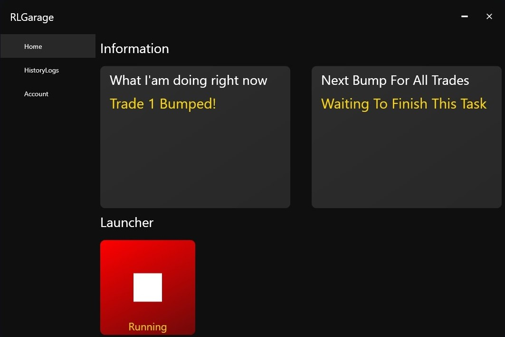

# RocketLeagueGarage
Rocket League Garage is automation that bump all your trades and also can bump them every 20 minutes.

Please support me by Leaving a star.

# Setup
- .NetCore 5.0 downloaded on your computer [.NetCore 5.0](https://dotnet.microsoft.com/download/dotnet/thank-you/runtime-desktop-5.0.0-windows-x64-installer).
- add your account information in the Account category.

# Images

# Video

https://youtu.be/UJOP9K11-2Y

# Build or install
- You can download open source code to build it.

or

- download the release from here [RLG](https://github.com/YoussofKhawaja/RocketLeagueGarage/releases)

# ToDo
- Custom CountDown.
- Live Share Chrome screen in app.
- Discord integration to start or stop software.
- Add specfic trades.

# Known Bugs
- If you have old chrome version on your computer, the Launcher may not work if Chrome Config didn't find an appropriate version of chrome same as you have.

to fix that just update your chrome from here (chrome://settings/help).

# Contributing
Pull requests are welcome. For major changes, please open an issue first to discuss what you would like to change.

Please make sure to update tests as appropriate.

# License
[MIT License](https://github.com/YoussofKhawaja/RocketLeagueGarage/blob/main/LICENSE)

